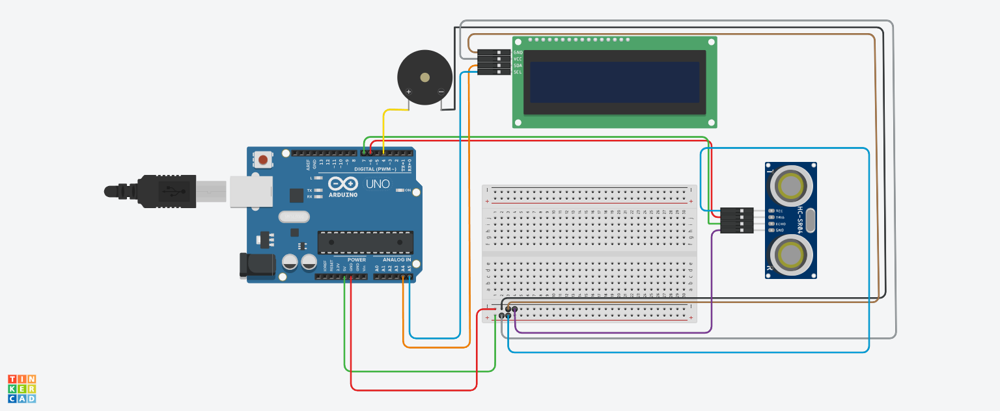
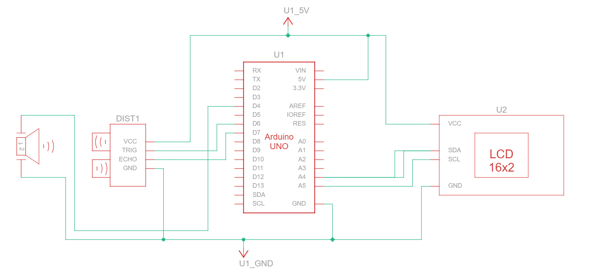

# Smart Waste Management System

## Abstract
The Smart Bin project enhances waste management efficiency by monitoring bin levels and alerting users when the bin is nearly full. Using an Arduino Uno and an ultrasonic sensor, the bin fill level is measured and displayed on an LCD. When the bin reaches 80% capacity, the buzzer is activated. Additionally, a real-time web interface has been developed using Node.js to monitor bin levels remotely, view alerts, and receive notifications. This combined hardware and software solution reduces overflow incidents and improves overall waste collection efficiency.

**Keywords:** Smart Bin, Arduino Uno, Ultrasonic Sensor, Real-time Monitoring, Automated Alerts, Node.js, Web Interface

---

## Hardware Components
All hardware components used for the project are listed [here](hardware/components-list.md).

**Key Components:**
- Arduino Uno R3
- Ultrasonic Distance Sensor (HC-SR04)
- Piezo Buzzer
- LCD 16x2 (I2C based)

---

## Schematics & Diagrams
### Circuit Diagram

### Schematic Diagram

---

### Libraries
Required libraries and instructions are listed in [`arduino-code/libraries.md`](arduino-code/libraries.md).

---

## Software Components
The web interface allows real-time monitoring of bin levels and automated alerts. Key components include:

- **Node.js backend** (`website-code/node.js`) for server-side logic, handling sensor data, and sending updates to the frontend.
- **HTML frontend** (`website-code/index.html`) displaying bin status, fill percentage, and alerts in a user-friendly dashboard.
- The backend communicates with the Arduino via serial communication or a local API to fetch real-time data.

---

## 🎥 Demo Video & Usage

<table>
<tr>

<td width="50%" valign="top" style="padding-right: 30px;">

### Usage Instructions
1. Assemble the hardware as per the circuit diagram. Ensure all connections are secure and the ultrasonic sensor is properly aligned.  
2. Connect the Arduino to your computer via USB.  
3. Open the Arduino IDE, load `arduino-code/smartbin.ino`, and upload it to the Arduino.  
4. Observe the LCD display for real-time bin fill level readings.  
5. When the bin reaches 80% capacity, the buzzer will sound as an automated alert.  
6. Open the serial monitor in Arduino IDE to see live sensor data and debug information.  
7. For remote monitoring, start the Node.js server by navigating to `website-code` and running `node node.js`.  
8. Open a web browser and go to `http://localhost:3000` (or the configured port) to access the Smart Bin dashboard.  
9. On the dashboard, you can view current bin levels, historical data, and receive real-time alerts when the bin is almost full.  
10. Ensure that both Arduino and Node.js server are running simultaneously for seamless real-time updates.  
11. Optionally, you can deploy the Node.js server on a local network to monitor multiple bins remotely.

</td>

<td width="50%" valign="top" style="padding-left: 30px;">

 
 

https://github.com/user-attachments/assets/93d1f2cc-a700-4139-8506-776b307e4188

</td>

</tr>
</table>

---
